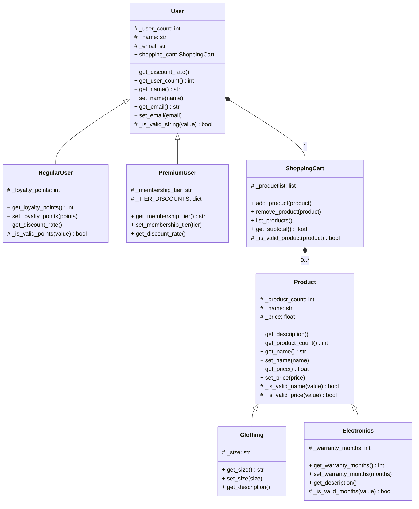

# UML Class Diagram

```mermaid
classDiagram
    User <|-- RegularUser
    User <|-- PremiumUser
    User *-- ShoppingCart: 1
    Product <|-- Clothing
    Product <|-- Electronics
    ShoppingCart *-- Product: 0..*

    class User {
        # _user_count: int
        # _name: str
        # _email: str
        + shopping_cart: ShoppingCart
        + get_discount_rate()
        + get_user_count() int
        + get_name() str
        + set_name(name)
        + get_email() str
        + set_email(email)
        # _is_valid_string(value) bool
    }

    class RegularUser {
        # _loyalty_points: int
        + get_loyalty_points() int
        + set_loyalty_points(points)
        + get_discount_rate()
        # _is_valid_points(value) bool
    }

    class PremiumUser {
        # _membership_tier: str
        # _TIER_DISCOUNTS: dict
        + get_membership_tier() str
        + set_membership_tier(tier)
        + get_discount_rate()
    }

    class ShoppingCart {
        # _productlist: list
        + add_product(product)
        + remove_product(product)
        + list_products()
        + get_subtotal() float
        # _is_valid_product(product) bool
    }

    class Product {
        # _product_count: int
        # _name: str
        # _price: float
        + get_description()
        + get_product_count() int
        + get_name() str
        + set_name(name)
        + get_price() float
        + set_price(price)
        # _is_valid_name(value) bool
        # _is_valid_price(value) bool
    }

    class Clothing {
        # _size: str
        + get_size() str
        + set_size(size)
        + get_description()
    }

    class Electronics {
        # _warranty_months: int
        + get_warranty_months() int
        + set_warranty_months(months)
        + get_description()
        # _is_valid_months(value) bool
    }
```